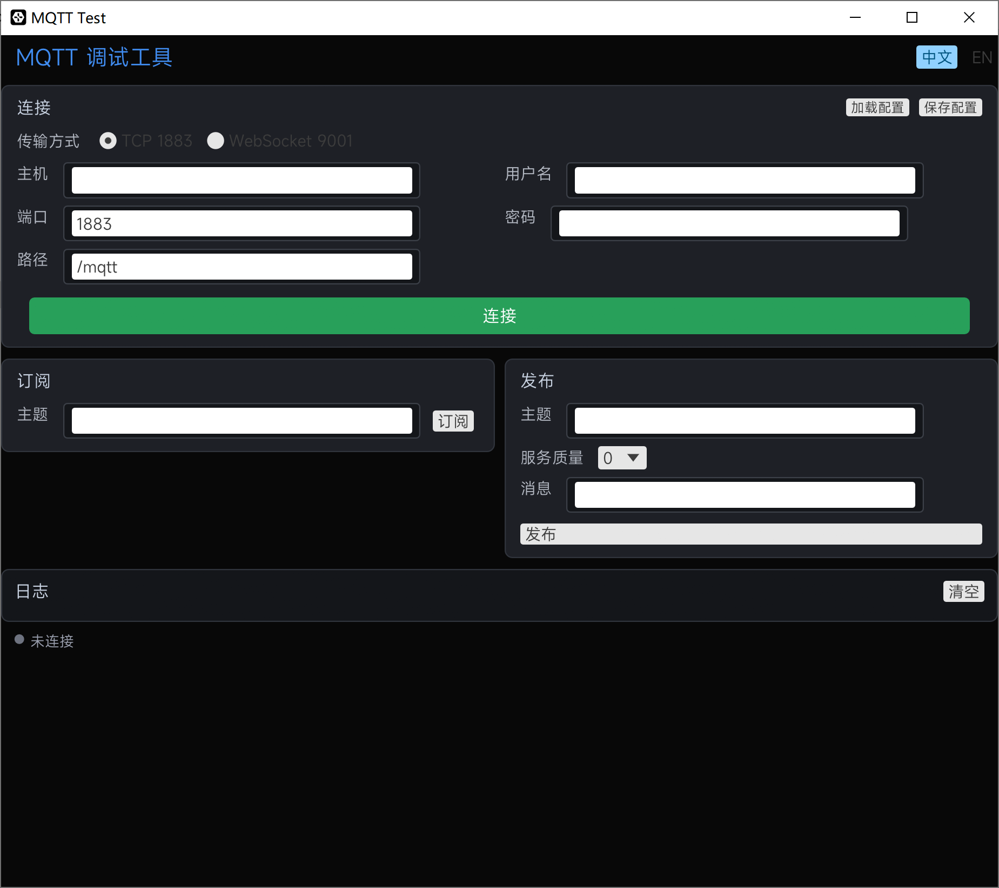

# MQTT 调试工具

基于 Rust + egui 的本地 GUI MQTT 客户端，支持 TCP 和 WebSocket 两种连接方式。



## 功能

- TCP (1883) / WebSocket (9001) 双协议连接
- 订阅 / 发布 / 实时日志
- 中文界面 + 中/英语言切换
- 连接配置保存/导入（JSON 文件）
- MiSans 字体嵌入，开箱即用

## 编译

```bash
# Release 构建（无终端窗口）
cargo build --release --jobs 8
```

编译产物：`target/release/mqtt-test.exe`

## 使用

1. 启动程序
2. 选择传输方式（TCP / WebSocket）
3. 填写主机、端口、用户名、密码
4. 点击「连接」
5. 连接成功后可订阅主题、发布消息、查看日志

### 配置保存

- 点击「保存配置」将当前连接信息写入 `mqtt_config.json`
- 下次启动自动加载该配置
- 也可通过「加载配置」从其他 JSON 文件导入

## 项目结构

```
mqtt-test/
├── Cargo.toml              # 项目依赖
├── src/
│   ├── main.rs             # egui 界面 + 应用入口
│   └── mqtt_client.rs      # MQTT 连接/订阅/发布逻辑
├── resources/
│   ├── fonts/
│   │   └── MiSans-Normal.ttf
│   └── ico/
│       └── mqtt_test-tools.ico
├── LICENSE                 # GPL-2.0 许可证
└── README.md
```

## 依赖

| 库 | 用途 |
|---|---|
| [rumqttc](https://crates.io/crates/rumqttc) | MQTT 客户端（支持 WebSocket） |
| [eframe](https://crates.io/crates/eframe) | GUI 框架 |
| [serde](https://crates.io/crates/serde) + serde_json | 配置序列化 |
| [rfd](https://crates.io/crates/rfd) | 原生文件对话框 |

## 许可证

本项目采用 [GNU General Public License v2.0](LICENSE) 许可证。
